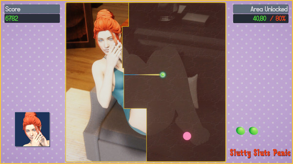

# Game/Unity Programmer

## Summary
I have 5 years of experience making 3D (NSFW and SFW) games with Unity. I published them at Itch.io and Steam, for PC and WebGL.

## Skills and abilities
**Excellent at:**
- Gameplay programming with C# and Unity
- Self-learning whatever I need to solve development problems
- Writing clean/readable code
- Debugging and bug fixing

**Proficient at:**
- Using Unity Profiler and optimize game performance
- Version control with Git, GitLab and GitHub
- Writing unit tests with NUnit and Unity Test Framework
  
**Familiar with:**
- Backend programming with Java and SQL
- Making 3D props and 3D animations with Blender

## Relevant experience
I've been coding and releasing 3D NSFW games as a solo developer since 2019.
Most of them are for PC, and recently I made 2 of them for WebGL thanks to the
jams I joined.

- Here's my Itch.io profile: [irisgamedev.itch.io](https://irisgamedev.itch.io/)
- Here's my Steam profile: [store.steampowered.com/developer/irisGameDev](https://store.steampowered.com/developer/irisGameDev)

## Projects:
**Slutty Sluts Panic**
- Description:  Slutty Sluts Panic is a Qix-like action puzzle arcade game. Players have to draw into an area to clear the level and reveal nude images. 
- Platforms: PC
- Development:

- Store page: [Slutty Sluts Panic on Steam](https://store.steampowered.com/app/1775850/Slutty_Sluts_Panic/)

**ERO Shooter**
- Description: 
- Platforms: PC
- Development:

- Store page: [ERO Shooter on Steam](https://store.steampowered.com/app/1445090/ERO_Shooter/)
