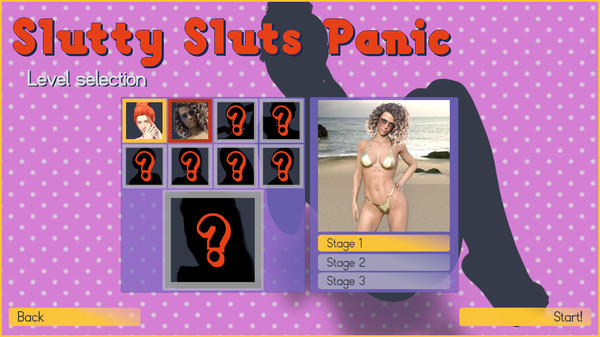
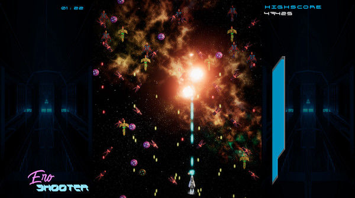

# Game/Unity Programmer

## Summary
I have 5 years of experience making 3D (NSFW and SFW) games with Unity. I published them at Itch.io and Steam, for PC and WebGL.

## Skills and abilities
**Excellent at:**
- Gameplay programming with C# and Unity
- Self-learning whatever I need to solve development problems
- Writing clean/readable code
- Debugging and bug fixing

**Proficient at:**
- Using Unity Profiler and optimize game performance
- Version control with Git, GitLab and GitHub
- Writing unit tests with NUnit and Unity Test Framework
  
**Familiar with:**
- Backend programming with Java and SQL
- Making 3D props and 3D animations with Blender

## Relevant experience
I've been coding and releasing 3D NSFW games as a solo developer since 2019.
Most of them are for PC, and recently I made 2 of them for WebGL thanks to the
jams I joined.

- Here's my Itch.io profile: [irisgamedev.itch.io](https://irisgamedev.itch.io/)
- Here's my Steam profile: [store.steampowered.com/developer/irisGameDev](https://store.steampowered.com/developer/irisGameDev)

## Projects:
**Slutty Sluts Panic**
  Small NSFW Qix-like game for PC.
  The player has to uncover the underneath image by moving through the level while avoiding enemies.
  I wrote all the code myself (persistence system, unlockable item system, image gallery, the game loop, game settings, etc.); except by the effects system (which is the MM Feedbacks package available on Unity Store).
  Regarding to art, I used Daz3D for the character/background renders with 3rd party models. I also made all of the graphic design work, except by the fonts.
  My favorite part was to figure out how to make the image-reveal mechanic. I ended up by placing a plane to block the unlockable image view, and spawning quads with a stencil shader material filling the cleared areas to reveal the unlockable image.
  
- Store page: [Slutty Sluts Panic on Steam](https://store.steampowered.com/app/1775850/Slutty_Sluts_Panic/)

**ERO Shooter**
- Description: 
- Platforms: PC
- Development:

- Store page: [ERO Shooter on Steam](https://store.steampowered.com/app/1445090/ERO_Shooter/)

